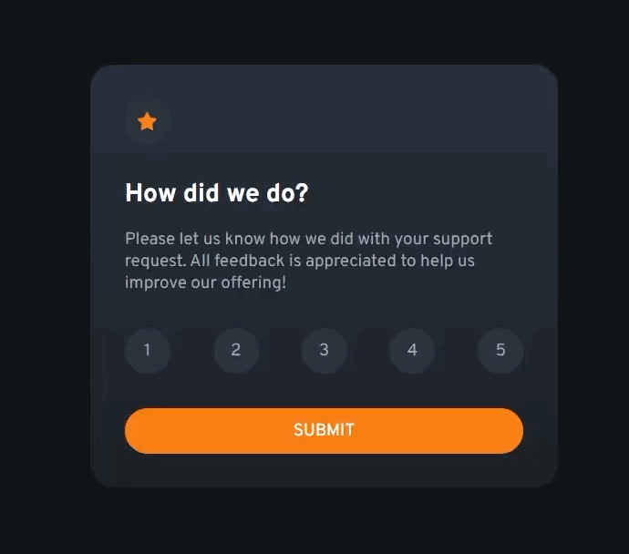

<h1> Rating Component</h1>

En este proyecto hago un componente de un Web App más amplia. Este componente solocita al usuario que evalue el soporte prestado por la app para asi poder mejorar.

<h1>Preview del proyecto<h1>

<h1>Funciones principales</h1>
  <ul>
    <li>Solicitar al usuario que evalue del 1 al 5 la atención recibida.</li>
    <li>Se debe mostrar con cambio de color el valor seleccionado por el usuario.</li>
    <li>El usuario puede cambiar de parecer y cambiar su respuesta antes de hacer click en el botón de submit.</li>
    <li>Al hacer click en Submit, se mostrará otra pantalla donde el usuario verá el número seleccionado y una mensaje de gracias.</li>
  </ul>
  
  <h1>Recursos utilizados</h1>
  <ul>
      <li>
<a href="https://www.w3schools.com/jsref/jsref_foreach.asp">JavaScript Array forEach()</a>
</li>
    
Documentación del metodo ForEach

      <li>
<a href="https://www.w3schools.com/js/js_if_else.asp">JavaScript if, else, and else if
</a>
</li>
    
Documentación los estados condicionales if, else if

    
    <li>
<a href="https://www.frontendmentor.io/home">Frontend Mentor</a>
</li>
    
Página Web donde podrás conseguir retos de Frontend. Muy recomendado!

  </ul>
  <h1>Código</h1>
  
Con toda libertad puedes bajar o clonar este repositorio!

  
Si tienes algún comentario o tienes una mejor forma de desarrollar el código, no dudes en comentarlo! Sharing Is Caring!

